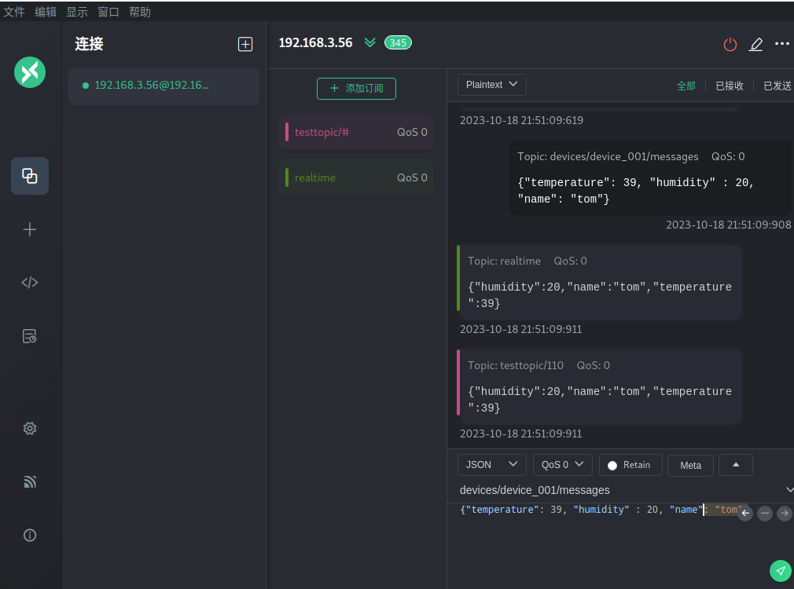

# 架构图

[img](./images/arch.png)

# 部署测试
使用Docker部署测试，
- mqtt服务器
- ekuiper
- mqtt客户端工具
- ekuiper管理工具


## mqtt服务器

```bash
docker pull emqx/emqx:latest
docker run -d --name emqx -p 1883:1883 -p 8083:8083 -p 8084:8084 -p 8883:8883 -p 18083:18083 emqx/emqx:latest
```
Start your web browser and enter http://localhost:18083/ ( localhost can be substituted with your IP address) in the address bar to access the EMQX Dashboard, from where you can connect to your clients or check the running status.

Default user name and password:
admin
public

## ekuiper

```bash
docker pull lfedge/ekuiper:x.x.x
docker run -p 9081:9081 -d --name kuiper -e MQTT_SOURCE__DEFAULT__SERVER=tcp://192.168.3.56:1883 lfedge/ekuiper:latest
```
通过环境变量指定默认的 MQTT 代理为tcp://192.168.3.56:1883,  192.168.3.56为本机物理网卡的ip地之。

## mqtt客户端工具

使用mqttx工具即可。




## ekuiper管理工具

```bash
docker run -p 9082:9082 -d --name manager -e DEFAULT_EKUIPER_ENDPOINT=http://192.168.3.56:9081 emqx/ekuiper-manager:latest
```
使用http://192.168.3.56:9082/ 可以进入到ekuiper的管理web.
